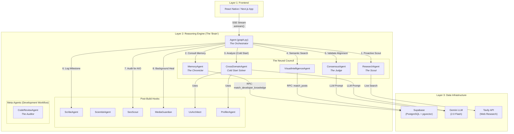
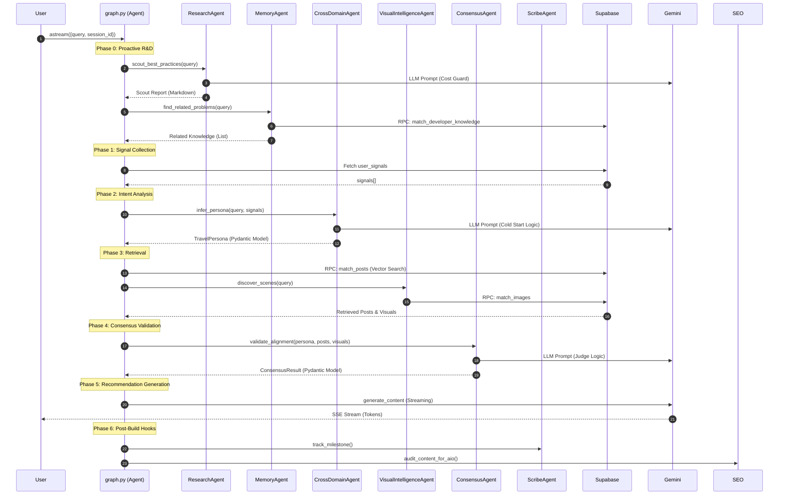

# Tripzy ARRE - Agent Communication Architecture

This document provides a graphical description of how the autonomous agents in the Tripzy Reasoning Engine communicate with each other.

## High-Level Architecture

---

## Communication Flow: Step-by-Step

The following sequence diagram shows a single user request lifecycle:

---

## Agent Roles Summary

| Agent                         | Role                                | Key Method                      | Data Flow              |
| :---------------------------- | :---------------------------------- | :------------------------------ | :--------------------- |
| **Orchestrator** (`graph.py`) | Central coordinator                 | `astream()`, `ainvoke()`        | Calls all other agents |
| **ResearchAgent**             | Live web research (Scout)           | `scout_best_practices()`        | Uses Tavily API        |
| **MemoryAgent**               | Institutional knowledge             | `find_related_problems()`       | Supabase RPC           |
| **CrossDomainAgent**          | Cold Start persona inference        | `infer_persona()`               | Gemini LLM             |
| **VisualIntelligenceAgent**   | Image semantic search               | `discover_scenes()`             | Supabase RPC           |
| **ConsensusAgent**            | Validates persona-content alignment | `validate_alignment()`          | Gemini LLM             |
| **ScribeAgent**               | Logs milestones                     | `track_milestone()`             | Supabase               |
| **ScientistAgent**            | Empirical validation                | `run_empirical_suite()`         | Gemini LLM             |
| **SeoScout**                  | AI Overview optimization            | `audit_content_for_aio()`       | Gemini LLM             |
| **MediaGuardian**             | Self-healing media library          | `heal_media_library()`          | Supabase               |
| **ProfilerAgent**             | User Soul updates                   | `update_user_soul()`            | Supabase               |
| **UxArchitect**               | Friction analysis                   | `analyze_interaction_signals()` | Gemini LLM             |

---

## Key Design Patterns

> [!IMPORTANT]
> All inter-agent communication is **asynchronous** via Python `async/await`. Agents are **singleton instances** imported by the orchestrator.

1.  **Centralized Orchestration:** `graph.py` is the single entry point. It decides when and how to call each agent.
2.  **Pydantic Contracts:** Agents return typed Pydantic models (e.g., `TravelPersona`, `ConsensusResult`) for structured data exchange.
3.  **LLM as a Service:** All agents use `gemini-2.0-flash` via the Gemini SDK, configured with `transport='rest'`.
4.  **Proactive Triggers:** Scout and Memory are called _before_ user intent analysis to provide context upfront.
5.  **Post-Build Hooks:** Scribe, Scientist, and SEO Scout run _after_ the main recommendation to ensure R&D visibility and compliance.
