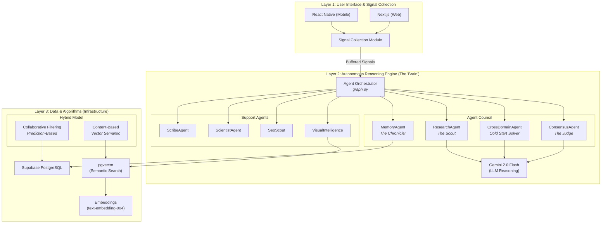
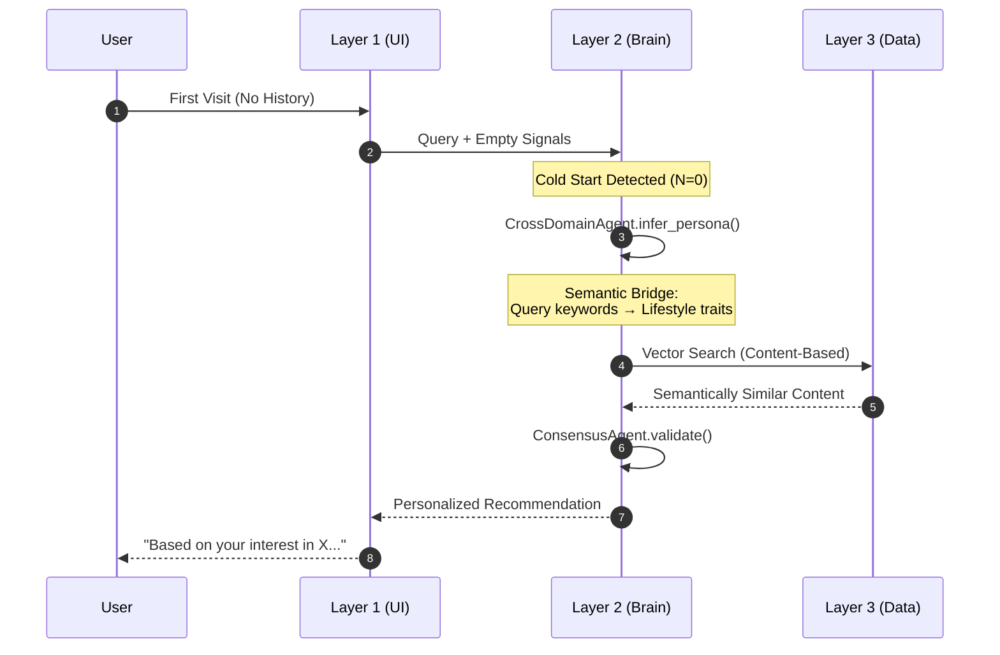
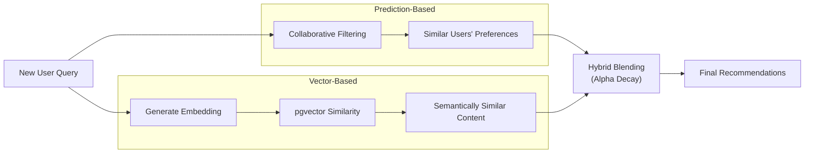

# Tripzy ARRE - 3-Layer Architecture

This document provides a graphical description of the foundational 3-Layer Architecture of the Tripzy Autonomous Agent-Based Recommendation Engine.

## High-Level Architecture

---

## Cold Start Solution Flow

The following sequence diagram shows how the system handles a user with ZERO history:

---

## Layer Details Summary

| Layer       | Component     | Technology            | Responsibility                           |
| :---------- | :------------ | :-------------------- | :--------------------------------------- |
| **Layer 1** | Mobile App    | React Native          | Cross-platform mobile experience         |
| **Layer 1** | Web App       | Next.js               | SEO-optimized web frontend               |
| **Layer 1** | Signal Module | Custom JS             | Buffers user interactions before sending |
| **Layer 2** | Orchestrator  | Python (graph.py)     | Central coordinator for all agents       |
| **Layer 2** | Agent Council | Python (Pydantic)     | Specialized AI agents for reasoning      |
| **Layer 2** | LLM           | Gemini 2.0 Flash      | Natural language understanding           |
| **Layer 3** | Database      | Supabase (PostgreSQL) | Relational data (profiles, bookings)     |
| **Layer 3** | Vector Store  | pgvector              | Semantic similarity search               |
| **Layer 3** | Embeddings    | text-embedding-004    | Converts text to vectors                 |

---

## Hybrid Recommendation Model

---

## Key Design Patterns

> [!IMPORTANT]
> **The Cold Start Problem is solved by Cross-Domain Transfer:** If a user has ZERO travel history, the system analyzes **lifestyle signals** (wellness, dining, shopping interests) to infer travel preferences.

1.  **Signal Buffering:** Layer 1 does NOT just send API requests. It buffers user interactions and sends them in batches.
2.  **Alpha Decay:** `α = max(0.0, 1.0 - (N × 0.1))` — At Cold Start (N=0), α=1.0 (100% vector-based). As signals grow, α decreases (more collaborative filtering).
3.  **Hybrid Model:** Combines Prediction-Based (Collaborative Filtering) and Vector-Based (Content-Based) recommendations.
4.  **LangGraph-style Orchestration:** Uses Pydantic models for structured agent outputs.
5.  **Supabase for Everything:** Relational data + Vector embeddings in one platform.
