# Tripzy ARRE - 3-Layer Architecture

This document describes the foundational 3-Layer Architecture of the Tripzy Autonomous Agent-Based Recommendation Engine.

---

## Architecture Overview

```mermaid
graph TB
    subgraph "LAYER 1: User Interface & Signal Collection"
        direction LR
        MOBILE["📱 React Native<br/>(Mobile App)"]
        WEB["🌐 Next.js<br/>(Web App)"]
        SIGNAL["Signal Collection Module"]

        MOBILE --> SIGNAL
        WEB --> SIGNAL
    end

    subgraph "LAYER 2: Autonomous Reasoning Engine"
        direction TB
        ORCH["🧠 Agent Orchestrator<br/>(graph.py)"]

        subgraph "Agent Council"
            SCOUT["🔭 ResearchAgent<br/><i>Scout</i>"]
            MEMORY["📚 MemoryAgent<br/><i>Chronicler</i>"]
            CROSS["🌉 CrossDomainAgent<br/><i>Cold Start Solver</i>"]
            JUDGE["⚖️ ConsensusAgent<br/><i>Judge</i>"]
        end

        subgraph "Support Agents"
            SCRIBE["✍️ ScribeAgent"]
            SCIENTIST["🔬 ScientistAgent"]
            SEO["📈 SeoScout"]
            VISUAL["🖼️ VisualIntelligence"]
        end

        LLM["🤖 Gemini 2.0 Flash<br/>(LLM Reasoning)"]
    end

    subgraph "LAYER 3: Data & Algorithms"
        direction LR
        SUPA["🐘 Supabase PostgreSQL"]
        VECTOR["🧮 pgvector<br/>(Semantic Search)"]
        EMBED["📊 Embeddings<br/>(text-embedding-004)"]

        subgraph "Hybrid Model"
            COLLAB["Collaborative Filtering<br/><i>Prediction-Based</i>"]
            CONTENT["Content-Based<br/><i>Vector Semantic</i>"]
        end
    end

    SIGNAL -- "Buffered Signals" --> ORCH
    ORCH --> SCOUT
    ORCH --> MEMORY
    ORCH --> CROSS
    ORCH --> JUDGE
    ORCH --> SCRIBE
    ORCH --> SCIENTIST
    ORCH --> SEO
    ORCH --> VISUAL

    SCOUT --> LLM
    CROSS --> LLM
    JUDGE --> LLM

    MEMORY --> SUPA
    VISUAL --> VECTOR
    VECTOR --> EMBED

    COLLAB --> SUPA
    CONTENT --> VECTOR
```



---

## Layer Details

### Layer 1: User Interface & Signal Collection

| Component     | Technology   | Responsibility                                      |
| :------------ | :----------- | :-------------------------------------------------- |
| Mobile App    | React Native | Cross-platform mobile experience                    |
| Web App       | Next.js      | SEO-optimized web frontend                          |
| Signal Module | Custom JS    | Buffers user interactions before sending to backend |

**Key Pattern:** The Signal Collection Module **does not** just send API requests. It buffers user interactions (clicks, hovers, scrolls, searches) and sends them in batches to Layer 2.

---

### Layer 2: Autonomous Reasoning Engine (The "Brain")

| Agent                | Role                     | Cold Start Strategy                         |
| :------------------- | :----------------------- | :------------------------------------------ |
| **Orchestrator**     | Central coordinator      | Routes to appropriate agents                |
| **ResearchAgent**    | Live web research        | Scouts latest trends via Tavily             |
| **MemoryAgent**      | Institutional memory     | Retrieves past solutions                    |
| **CrossDomainAgent** | Persona inference        | **Solves Cold Start** via lifestyle signals |
| **ConsensusAgent**   | Validation               | Ensures persona-content alignment           |
| **ScribeAgent**      | Logging                  | Tracks milestones for R&D                   |
| **ScientistAgent**   | Empirical validation     | Runs test suites                            |
| **SeoScout**         | AI Overview optimization | Audits for AIO visibility                   |

**Key Pattern:** Uses **LangGraph-style orchestration** with Pydantic models for structured agent outputs.

---

### Layer 3: Data & Algorithms (The Infrastructure)

| Component    | Technology                | Purpose                                    |
| :----------- | :------------------------ | :----------------------------------------- |
| Database     | Supabase (PostgreSQL)     | Relational data (profiles, bookings, logs) |
| Vector Store | pgvector extension        | Semantic similarity search                 |
| Embeddings   | Gemini text-embedding-004 | Converts text to vectors                   |

**Hybrid Recommendation Model:**


**Alpha Decay Formula:**

```
α = max(0.0, 1.0 - (N × 0.1))
```

Where `N` = number of user signals. At Cold Start (N=0), α=1.0 (100% vector-based). As signals grow, α decreases (more collaborative filtering).

---

## Cold Start Solution Flow

```mermaid
sequenceDiagram
    participant User
    participant Layer1 as Layer 1 (UI)
    participant Layer2 as Layer 2 (Brain)
    participant Layer3 as Layer 3 (Data)

    User->>Layer1: First Visit (No History)
    Layer1->>Layer2: Query + Empty Signals

    Note over Layer2: Cold Start Detected (N=0)
    Layer2->>Layer2: CrossDomainAgent.infer_persona()
    Note over Layer2: Semantic Bridge:<br/>Query keywords → Lifestyle traits

    Layer2->>Layer3: Vector Search (Content-Based)
    Layer3-->>Layer2: Semantically Similar Content

    Layer2->>Layer2: ConsensusAgent.validate()
    Layer2-->>Layer1: Personalized Recommendation
    Layer1-->>User: "Based on your interest in X..."
```



---

> [!IMPORTANT]
> **The Cold Start Problem is solved by Cross-Domain Transfer:** If a user has ZERO travel history, the system analyzes **lifestyle signals** (wellness, dining, shopping interests) to infer travel preferences.
