# 📐 Tripzy Intelligence Architecture Diagrams

> **Document Version:** 1.0  
> **Date:** January 2, 2026  
> **Description:** Visual representations of the Universal Plugin Architecture, Agent Workflows, and Data Pipelines to support the [Advanced Intelligence Roadmap](./advanced_intelligence_roadmap.md).

---

## 1. 🔌 The "Brain-in-a-Box" Integration Model

This diagram illustrates how the **Tripzy Intelligence SDK** plugs into _any_ Host Application (Travel, Real Estate, Finance) without tighter coupling.

---

## 2. 🧠 The Multi-Agent "Council" Workflow

How a live user query is processed by the specialized agents in Layer 2.

```mermaid
sequenceDiagram
    participant User
    participant SDK as Tripzy SDK
    participant Profiler as 🕵️ Profiler
    participant Trendsetter as ⚡ Trendsetter
    participant Critic as ⚖️ Critic
    participant VectorDB as 📚 Vector DB

    User->>SDK: "I want a weekend getaway" (Query)

    par Parallel Analysis
        SDK->>Profiler: Get User "Soul" (Long-term Interest)
        Profiler-->>SDK: { "Loves": "Nature", "Hates": "Crowds" }

        SDK->>Trendsetter: Get Domain Trends
        Trendsetter-->>SDK: { "Trending": "Cabin Retreats", "Event": "Meteor Shower" }
    end

    SDK->>VectorDB: Semantic Search ("Nature" + "Cabin" + "Quiet")
    VectorDB-->>SDK: [Result A, Result B, Result C]

    loop For Each Result
        SDK->>Critic: Check Feasibility (Result, Weather, Price)
        Critic-->>SDK: Veto Result B (Too Expensive)
    end

    SDK->>User: Return [Result A, Result C] + UI Directive ("Immersion Mode")
```

---

## 3. 🌙 The "Dreaming" Cycle (Zero Latency)

How the system effectively "predicts the future" by running whilst the user sleeps.

---

## 4. 🧬 Generative UI Signal Flow

How the SDK controls the Host App's interface without rendering pixels itself (Headless UI).

