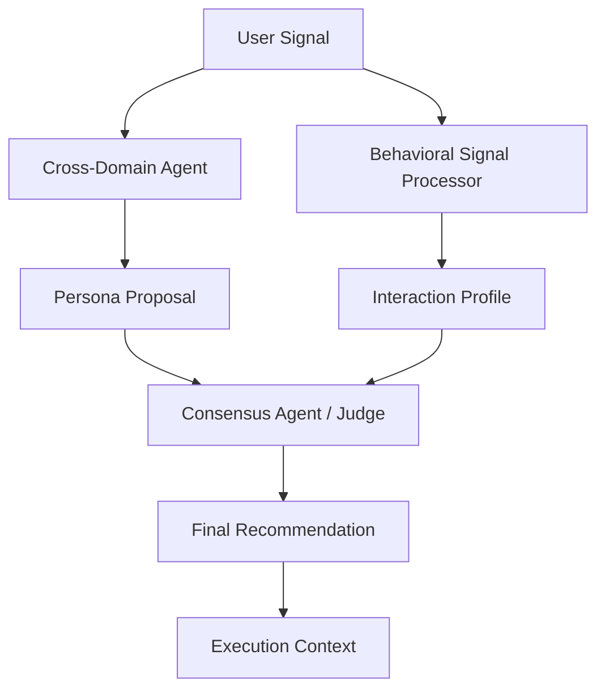

# R&D Methodology: Phase 3 - Hybrid Consensus & Warm-Start Transition

**Status**: RESEARCH_DRAFT  
**Protocol**: TRP-RDP-003  
**Focus**: Multi-Agent Validation Layer

## 1. Research Questions

1. **Consensus Problem**: How can we mathematically resolve the conflict when an inferred "Luxury" vibe meets "Budget" user interaction signals?
2. **Relevance Decay**: How quickly should the "Cold Start" inference decay as real-time interaction signals increase?
3. **Committee Logic**: Can a dedicated "Judge Agent" improve recommendation precision compared to a single-pass reasoner?

## 2. Technical Architecture: The Consensus Layer

The architecture moves from a linear pipeline to a structured committee:

### 2.1 The Hybrid Weighting Formula

We will implement a dynamic weighting $W$ for recommendations:
$$W_{final} = (\alpha \cdot V_{inferred}) + ((1 - \alpha) \cdot V_{behavioral})$$
Where $\alpha$ (Alpha) starts at 1.0 (Pure Cold Start) and decays toward 0.0 as the number of user signals $N$ increases.

## 3. Consensus Logic (The "Judge")

The `ConsensusAgent` will perform **Semantic Alignment Checks**:

- **Constraint Matching**: Does the recommended hotel actually fit the "No Crowds" constraint?
- **Tone Consistency**: Does the generated text match the user's inferred pace (Slow/Fast)?
- **Hallucination Guard**: Cross-checking retrieval IDs against the final LLM output strings.

## 4. Expected Proof of Work

- Implementation of the `ConsensusAgent` (Python 3.14).
- Transition logs demonstrating "Inference Decay" over time.
- Automated verification of "Rejection vs. Acceptance" logic in the consensus phase.
