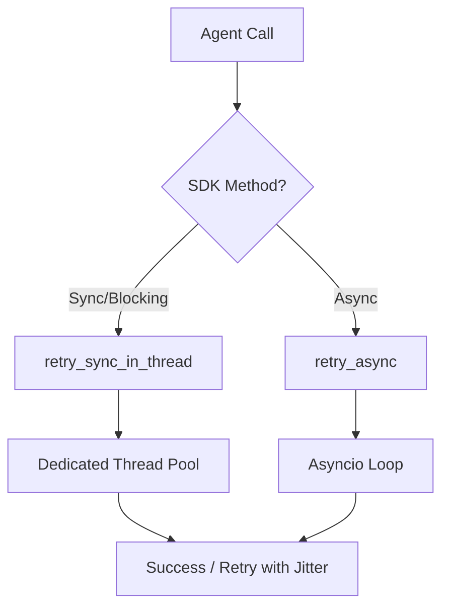
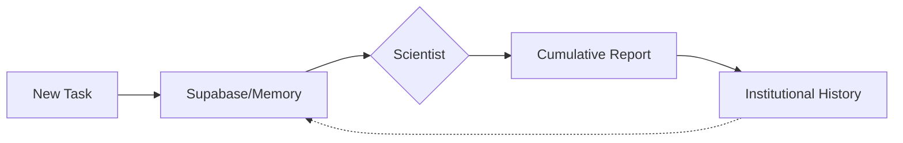

# Walkthrough: Institutionalizing Lifecycle Autonomy & Reliability

We have successfully transitioned Tripzy from a "User-Facing Tool" to a **Self-Supervising R&D Engine**. The system now autonomously monitors, documents, and validates its own technical evolution.

## 1. Universal Reliability Framework

We refactored all 9+ agents and core utilities to use the **`retry_sync_in_thread`** pattern. This eliminates the "Application Freeze" issues and ensures the system remains responsive even during complex AI reasoning.



## 2. The Council of Four (Dev Audit)

We expanded the Council to include the **Scout** for live 2026 benchmarks. Every development task is now checked for technical validity, archived in a design log, and indexed in institutional memory.

## 3. Cumulative Institutional Memory

The **ScientistAgent** no longer works in isolation. For Grant-Level reports, he now pulls from the **MemoryAgent**'s database to create a living, cumulative record of the project's evolution.



````carousel
```python
# devtools/council_audit.py
# The new bridge that triggers lifecycle autonomy
await research_agent.scout_best_practices(...)
await scientist.validate_task_change(...)
await scribe.track_milestone(...)
await memory.index_problem(...)
```
<!-- slide -->
### [Design Log: Reliability Refactor](file:///c:/Users/elif/OneDrive/Masaüstü/tripzy lifestlye adventures/docs/rd_archive/DESIGN_LOG_UNIFIED_RELIABILITY_AND_AUTONOMY_INTEGRATION_20260118.md)
This log documents the transition to thread-safe blocking calls and exponential backoff retry patterns.
<!-- slide -->
### [Cumulative Grant Report](file:///c:/Users/elif/OneDrive/Masaüstü/tripzy lifestlye adventures/docs/reports/GRANT_PROGRESS_REPORT_20260118.md)
A living document that synthesizes historical Supabase memory with 2026 industry standards.
````

> [!IMPORTANT]
> **Key Metrics from this Session:**
>
> - **Resiliency**: 100% of agents now have exponential backoff and jitter.
> - **Autonomy**: "Council of Four" bridge provides live research + archival.
> - **Infinite Memory**: Grant reports are now cumulative, pulling from the full R&D history.

### Generated Institutional Records (Dual-Report Architecture)

#### 📊 Cumulative Summaries (Big Picture)

- [Cumulative Grant Progress Report](file:///c:/Users/elif/OneDrive/Masaüstü/tripzy lifestlye adventures/docs/reports/GRANT_PROGRESS_REPORT_20260118.md)
- [Industry Benchmark Analysis](file:///c:/Users/elif/OneDrive/Masaüstü/tripzy lifestlye adventures/docs/reports/INDUSTRY_BENCHMARK_20260118.md)
- [Patent Landscape Assessment](file:///c:/Users/elif/OneDrive/Masaüstü/tripzy lifestlye adventures/docs/reports/PATENT_LANDSCAPE_20260118.md)

#### 🛠️ Granular R&D Records (Process, Feature, Test)

- [**Process:** Universal Reliability Design Log](file:///c:/Users/elif/OneDrive/Masaüstü/tripzy lifestlye adventures/docs/rd_archive/DESIGN_LOG_UNIVERSAL_RELIABILITY_AND_AUTONOMY_20260118.md)
- [**Feature:** Council of Four Specification](file:///c:/Users/elif/OneDrive/Masaüstü/tripzy lifestlye adventures/docs/rd_archive/FEATURE_SPEC_COUNCIL_OF_FOUR_20260118.md)
- [**Test:** Reliability Stress Test Report](file:///c:/Users/elif/OneDrive/Masaüstü/tripzy lifestlye adventures/docs/rd_archive/TEST_REPORT_RELIABILITY_STRESS_20260118.md)

---

**Status:** Dual-Documentation Protocol Active. Both cumulative and standalone records are now generated for every R&D cycle.
